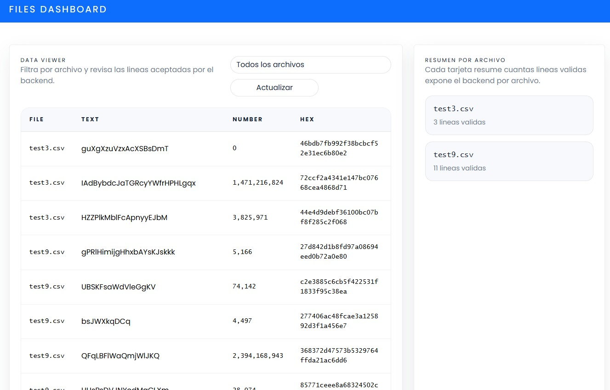

# File Explorer

This project contains two applications:

- `api`: a Node.js + Express REST API
- `frontend`: a React client that consumes the local API

## Preview



## Run With Docker Compose

Before starting with Docker Compose, make sure the API environment file exists:

```powershell
cd api
Copy-Item .env.example .env
cd ..
```

From the project root:

```powershell
docker compose up --build
```

## Run With Makefile

You can also use shorter commands from the project root:

```powershell
make up
```

Available commands:

- `make up`: build and start the apps
- `make down`: stop the containers
- `make build`: build the images
- `make rebuild`: rebuild without cache
- `make logs`: show live logs
- `make ps`: show running services
- `make restart`: restart the stack
- `make clean`: stop containers and remove volumes
- `make test`: run API and frontend tests

Published services:

- Frontend: `http://localhost:8080`
- API: `http://localhost:3001`

Useful endpoints:

- `GET http://localhost:3001/files/list`
- `GET http://localhost:3001/files/data`
- `GET http://localhost:3001/files/data?fileName=file1.csv`

To stop the containers:

```powershell
docker compose down
```
